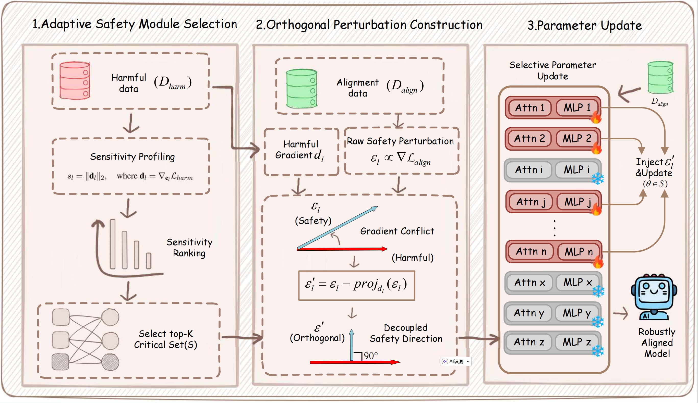

<h1 align="center">OASIS: Mitigating Harmful Fine-tuning Attacks on LLMs via Orthogonal and Adaptive Safety Alignment Strategy</h1>

OASIS addresses harmful fine-tuning attacks in the Fine-Tuning-as-a-Service setting. The method combines orthogonal safety perturbations with adaptive sensitive-layer selection, so the safety signal is decoupled from harmful gradient directions while remaining parameter efficient.

<div align="center">
  
</div>

## Highlights

- Orthogonal perturbation reduces gradient conflict between safety alignment and harmful adaptation.
- Adaptive module selection targets sensitive transformer layers and updates the corresponding Attention and MLP LoRA modules.
- This release focuses on OASIS and representative alignment baselines used in the main experimental pipeline.

## Repository Layout

```text
OASIS/
|-- train.py
|-- trainer.py
|-- utils.py
|-- loggers.py
|-- environment.yml
|-- data/
|-- agnews/
|-- gsm8k/
|-- sst2/
|-- poison/evaluation/
|-- models/
|-- loss_func/
|-- images/
`-- script/
    |-- alignment/
    `-- finetune/
```

## Environment

```bash
conda env create -f environment.yml
conda activate OASIS
```

## Data Preparation

The repository uses:

- BeaverTails for safety alignment and harmful attack construction
- SST2, GSM8K, and AG News for downstream utility evaluation

Prepare the downstream task data with:

```bash
python sst2/build_dataset.py
python gsm8k/build_dataset.py
python agnews/build_dataset.py
```

This will create:

- `data/sst2.json`
- `data/gsm8k.json`
- `data/ag_news.json`

You should also provide:

- `data/beavertails_with_refusals_train.json`

If you keep BeaverTails somewhere else, you can pass its path directly to the scripts.

## Model Access

If you use gated models such as Llama 2, either:

```bash
echo "YOUR_HF_TOKEN" > huggingface_token.txt
```

or set:

```bash
export HF_TOKEN=YOUR_HF_TOKEN
```

## Main Usage

### 1. Safety Alignment

Run OASIS alignment on BeaverTails:

```bash
bash script/alignment/OASIS.sh 3 /path/to/base-model data/beavertails_with_refusals_train.json PKU-Alignment/beaver-dam-7b PKU-Alignment/BeaverTails 20
```

Arguments:

- `3`: perturbation radius `rho`
- `/path/to/base-model`: backbone model path
- `data/beavertails_with_refusals_train.json`: safe-alignment dataset with refusal responses
- `PKU-Alignment/beaver-dam-7b`: moderation model used for harmful-score evaluation
- `PKU-Alignment/BeaverTails`: BeaverTails dataset path
- `20`: top-k sensitive layers used by OASIS

The script uses the default harmful-gradient estimation setting from the original experiments (`--prompt_data_size 100`) and refreshes the sensitive-layer set every 100 steps by default (`--update_freq 100`). The aligned adapter will be saved under:

```text
ckpt/alignment/<model>_oasis_3_20_20
```

The top-k value defaults to `20` and can be overridden by passing the last script argument.

### 2. Harmful Fine-tuning + Task Evaluation

Fine-tune the aligned adapter on SST2 mixed with harmful data:

```bash
bash script/finetune/sst2.sh ckpt/alignment/<model>_oasis_3_20_20 /path/to/base-model 0.1 1000 PKU-Alignment/beaver-dam-7b PKU-Alignment/BeaverTails glue
```

Fine-tune on AG News:

```bash
bash script/finetune/agnews.sh ckpt/alignment/<aligned_ckpt> /path/to/base-model 0.1 1000 PKU-Alignment/beaver-dam-7b PKU-Alignment/BeaverTails ag_news
```

Fine-tune on GSM8K:

```bash
bash script/finetune/gsm8k.sh ckpt/alignment/<aligned_ckpt> /path/to/base-model 0.1 1000 PKU-Alignment/beaver-dam-7b PKU-Alignment/BeaverTails gsm8k
```

## Baselines

The alignment scripts for the paper baselines are also included:

- `script/alignment/SFT.sh`
- `script/alignment/Vaccine.sh`
- `script/alignment/T-Vaccine.sh`
- `script/alignment/Tar.sh`
- `script/alignment/Repnoise.sh`
- `script/alignment/Orthogonal.sh`

All of them can be paired with the same downstream fine-tuning scripts under `script/finetune/` by passing the corresponding aligned checkpoint directory.

## Notes

- The old experimental analysis, plotting utilities, and historical trial scripts are intentionally removed from this public release.
- No previous `.git` history is included in this folder.
- Generated checkpoints, logs, caches, and local tokens are ignored by `.gitignore`.

## Citation

If you find this repository useful, please cite the OASIS paper.
